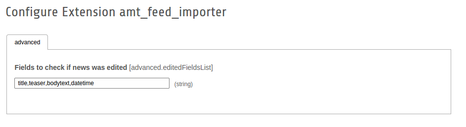

.. ==================================================
.. FOR YOUR INFORMATION
.. --------------------------------------------------
.. -*- coding: utf-8 -*- with BOM.

.. include:: ../Includes.txt

.. _administration:

Administration
==============

.. _administration-installation:

Installation
------------

Installation is very simple. You have to only get extension from the main repository. Please find "amt_feed_importer" and download it. It doesn't have any TypoScript configuration to include to templates.

.. _administration-configuration:

Configuration
-------------

Feed configuration has option to enable overriding news when some fields were changed in news record. If you want to change these fields you have to go into extension configuration in Extension Manager and edit list of them. Default fields are title,teaser,bodytext,datetime.

.. _administration-scheduler:

Scheduler
---------

The most important thing is made feed import run automatically. To do this you have to create another task in Scheduler and choose single task from "amt_feed_importer" section. You will see field called "Feed" with created configurations for the chosen task (e.g. RSS2 task will have listed only RSS2 configurations).