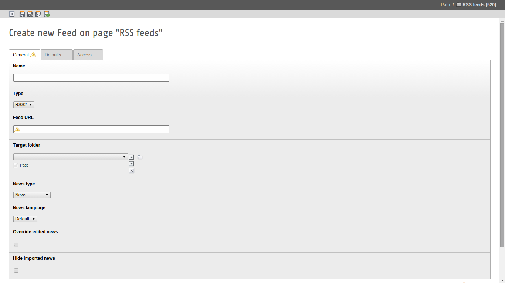

.. ==================================================
.. FOR YOUR INFORMATION
.. --------------------------------------------------
.. -*- coding: utf-8 -*- with BOM.

.. include:: ../Includes.txt

.. _users-manual:

Users manual
============

.. _users-manual-configuration:

Configuration
-------------

You have to fill configuration record which looks like this on the screenshot below (feed URL is required). These records could exist in every page from the page tree but of course the best way would be created them in one place.

.. _users-manual-feed:

Feed
----

.. t3-field-list-table::
 :header-rows: 1

 - :Field:
         Field

   :Description:
         Description

 - :Field:
         Name

   :Description:
   		Feed name which will be visible in the Scheduler list

 - :Field:
         Type

   :Description:
   		Feed type like RSS2, Atom, etc. (currently available only RSS2 and Atom)

 - :Field:
         Feed URL

   :Description:
   		URL with feed content

 - :Field:
         Target folder

   :Description:
   		Place where imported news will be saved. It could be every page type but should be storage folder.

 - :Field:
         News type

   :Description:
   		News types from the news extension used to save imported entry

 - :Field:
         News language

   :Description:
   		System language used to save imported news

 - :Field:
         Override edited news

   :Description:
   		If you want to override news which was edited by some BE user you should check this option. News is edited when one of the fields will changed. Default list contains title, teaser, bodytext and datetime.

 - :Field:
         Hide imported news

   :Description:
   		If you want to hide news after import you should check this option. It is helpfully when user wants to read news before publication

 - :Field:
         Default categories

   :Description:
   		Chosen categories will be set as default for the imported news

 - :Field:
         Default author

   :Description:
   		Given author will be set as default when author name from feed will be empty

 - :Field:
         Default author email

   :Description:
   		Given author email will be set as default when author tag from feed will be empty

 - :Field:
         Custom mappings

   :Description:
   		Use this field if you want get data from non-standard tags. Configuration should be write in TypoScript style

 - :Field:
         Social feed

   :Description:
        Check this option if you want import news from Facebook feed
   		
.. _users-manual-mapping:

Custom mapping
--------------

You can add custom mapping to your configuration which makes possibility to override some default values or map non-standard feed tags. 

::
	
	feed_namespace {
		attribute = database_field
	}
	
	tag = database_field
	
Example
*******

::

	content {
		encoded = bodytext
	}

Clear default field
-------------------

If you want to clear one of the default fields you can do this in simple way using custom mapping.

::

    clear_field = database_field

Example
*******

To clear teaser field you have to add below code to custom mapping

::

    clear_field = teaser
